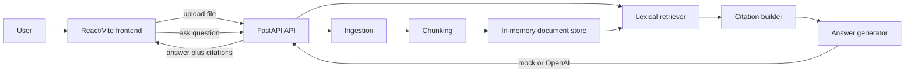

# AI Document Q&A Agent

A portfolio-grade MVP for document question answering. Upload a PDF or text-like document, ask a question, and receive an answer with citations tied back to retrieved source chunks.

The app runs locally with a deterministic mock answer generator by default, so it does not require paid API keys. If `OPENAI_API_KEY` is available, the backend can optionally use OpenAI for answer synthesis while keeping the same retrieval and citation pipeline.

## Architecture



## Project Structure

```text
ai-document-qa-agent/
  backend/
    app/
      api/routes.py
      answer_generation.py
      chunking.py
      citations.py
      config.py
      domain.py
      ingestion.py
      main.py
      retrieval.py
      store.py
    tests/
      test_chunking.py
      test_citations.py
      test_retrieval.py
    requirements.txt
  frontend/
    src/
      api/client.js
      components/
      App.jsx
      main.jsx
      styles.css
    package.json
    vite.config.js
  docker-compose.yml
```

## Local Setup

Prerequisites:
- Python 3.11+
- Node.js 20.19+ or 22.12+ for the Vite 7 frontend toolchain

### Backend

```bash
cd /Users/nass/PycharmProjects/Portfolio/v0-robotics-portfolio-website/portfolio-projects/ai-document-qa-agent
python3 -m venv .venv
source .venv/bin/activate
pip install -r backend/requirements.txt
uvicorn app.main:app --reload --app-dir backend --host 0.0.0.0 --port 8000
```

The API will be available at `http://localhost:8000`, with interactive docs at `http://localhost:8000/docs`.

### Optional OpenAI Answer Synthesis

The mock generator is the default and needs no external services. To use OpenAI for synthesis:

```bash
export ANSWER_PROVIDER=openai
export OPENAI_API_KEY=your_key_here
export OPENAI_MODEL=gpt-4o-mini
uvicorn app.main:app --reload --app-dir backend --port 8000
```

Use `ANSWER_PROVIDER=auto` to use OpenAI when a key is present and fall back to the mock generator otherwise.

### Frontend

```bash
cd frontend
npm install
npm run dev
```

The frontend expects the API at `http://localhost:8000`. Override it with:

```bash
VITE_API_BASE_URL=http://localhost:8000 npm run dev
```

## Tests

The core RAG pieces are tested without external services:

```bash
cd /Users/nass/PycharmProjects/Portfolio/v0-robotics-portfolio-website/portfolio-projects/ai-document-qa-agent
python3 -m unittest discover backend/tests
python3 -m compileall backend/app backend/tests
```

## API Summary

- `GET /health` checks service status and selected answer provider.
- `POST /documents` uploads one document and indexes its chunks in memory.
- `GET /documents` lists uploaded documents for the current backend process.
- `DELETE /documents` clears the in-memory store.
- `POST /ask` retrieves relevant chunks and returns an answer plus citations.

## Production Notes

This MVP intentionally uses an in-memory store and lexical retrieval so it is easy to run and inspect locally. In production, swap the store and retriever boundaries for durable storage, background ingestion jobs, embeddings, vector search, access control, file virus scanning, observability, and stricter document parsing. The citation builder preserves chunk ids and source offsets so the answer surface can stay provenance-aware even after those upgrades.
